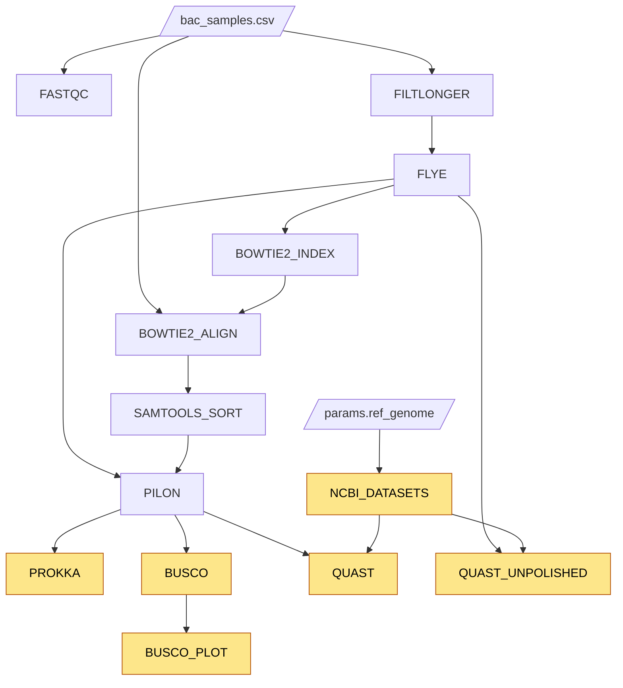

# Project 1 - Week 3: Wrapping up and evaluating our assembly

For the final week, we will be evaluating our assembly and comparing it to a 
reference genome. As we briefly discussed in class, there are several important 
criteria we can use to evaluate our assembly, including contiguity, completeness
and correctness. We will be performing several analyses to look at the quality
of our genome. 

## Relevant Resources

- [Using Conda with VSCode and Jupyter Notebooks]({{site.baseurl}}/guides/notebooks_computational_envs/)
- [Project 1 Report Guidelines]({{site.baseurl}}/guides/project_report_guidelines/)

## Objectives

As with last week, I will provide you with working modules for most of this
week's new steps - `BUSCO`, `NCBI_DATASETS`, `QUAST`, and `BUSCO_PLOT` - and
task you with connecting them to form a working pipeline. Please focus on
understanding how inputs and output channels are passed between processes and
how to connect them appropriately. Unlike those modules, I will ask you to put
together the `PROKKA` module yourself: you will have to determine the right
inputs and outputs as well as the appropriate running command. You will once
again be provided a description of the workflow and will need to figure
out the order of operations and dependencies between the processes to
construct the workflow. 

You should also use the remaining time to put together your
writeup for project 1 if you haven't already.


## Setting up

1. Clone the GitHub repo for this project - you may find the link on Blackboard

## Tasks

### Always confirm your workflow with a `-stub` run first

As in the previous two weeks, verify each change you make below by running

```bash
nextflow run week3.nf -stub
```

A `-stub` run executes each process's `stub:` block (the placeholder `touch`
commands) instead of its real `script:` block, so it finishes almost
instantly and doesn't require building conda environments or submitting jobs
to the SCC. That means a successful stub run only tells you that your
channels and processes are wired together correctly and producing outputs
named the way downstream steps expect - it does **not** confirm that the
command you write for `PROKKA`, or the real commands in the other modules,
are actually correct.


### Write the PROKKA module

Unlike this week's other new modules, `modules/prokka/main.nf` is left for
you to write from scratch.

1. Create the `PROKKA` process in `modules/prokka/main.nf`, following the
same structure as this week's other modules (`label`, `conda`,
`publishDir`, `input:`, `output:`, `script:`, and a `stub:` block).

2. This process should take a genome assembly (the same way `BUSCO` and
`QUAST` do) as input and produce Prokka's annotation output.

3. Look up Prokka's documentation for the appropriate command, making sure
to specify an appropriate label and use `$task.cpus` in the command for the
number of threads.

### Connect the processes



*Highlighted nodes are this week's new processes.*

1. Look at the inputs and outputs of each module - including the `PROKKA`
module you just wrote - and try to construct the workflow by passing the
correct channels to each process. You will need to understand the order of
operations and the dependencies between the processes to construct the
workflow. If you find it useful, I have included a visual representation of
the DAG for the workflow in the diagram above.

   Note that `QUAST` is imported twice in `week3.nf` - once as `QUAST` and once
   aliased as `QUAST_UNPOLISHED` - so that you can reuse the same process to
   compare both the polished and unpolished assemblies against a reference.
   Under the `// THIS WEEK` comment in the `workflow` block, you'll need to:

   - Annotate the polished assembly with `PROKKA`.
   - Run `BUSCO` on the polished assembly to assess its completeness.
   - Use `NCBI_DATASETS` to download the reference genome named in
     `params.ref_genome` (set in `nextflow.config`), so you have something to
     compare your assembly against.
   - Run `QUAST` comparing the **polished** assembly to the downloaded reference.
   - Run `QUAST_UNPOLISHED` comparing the **unpolished** assembly to the same
     reference, so you can see what Pilon's polishing step actually improved.
   - Run `BUSCO_PLOT` on the `BUSCO` output to visualize its completeness
     results.

   *Please note that while you can alter the inputs / outputs, you should
   be able to run the pipeline successfully by simply passing the correct outputs
   to the correct processes. If you do change the inputs / outputs, you will need
   to ensure that the pipeline still runs successfully.* 

2. Once your `-stub` runs succeed, run the pipeline for real and observe if
it runs successfully. If it doesn't, you will need to go back and fix the
workflow. You should use the following command:

   ```bash
   nextflow run week3.nf -profile cluster,conda
   ```

### Finalize the project report for project 1

Follow the [Project 1 Report Guidelines]({{site.baseurl}}/guides/project_report_guidelines/) to make a final report for this project.

## Week 3 Recap

- [ ] Write the `PROKKA` module (label, inputs, outputs, script, and stub)
- [ ] Connect `PROKKA`, `BUSCO`, `NCBI_DATASETS`, `QUAST`, `QUAST_UNPOLISHED`,
and `BUSCO_PLOT` into the workflow
- [ ] Run the pipeline with `-stub` and confirm it completes successfully
- [ ] Run the pipeline for real with `nextflow run week3.nf -profile cluster,conda`
- [ ] Finalize the project report for project 1
